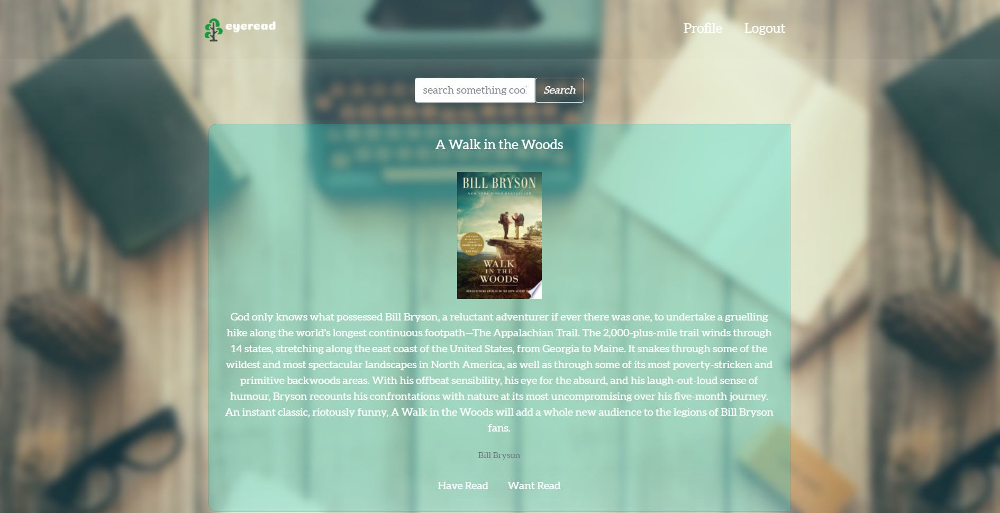
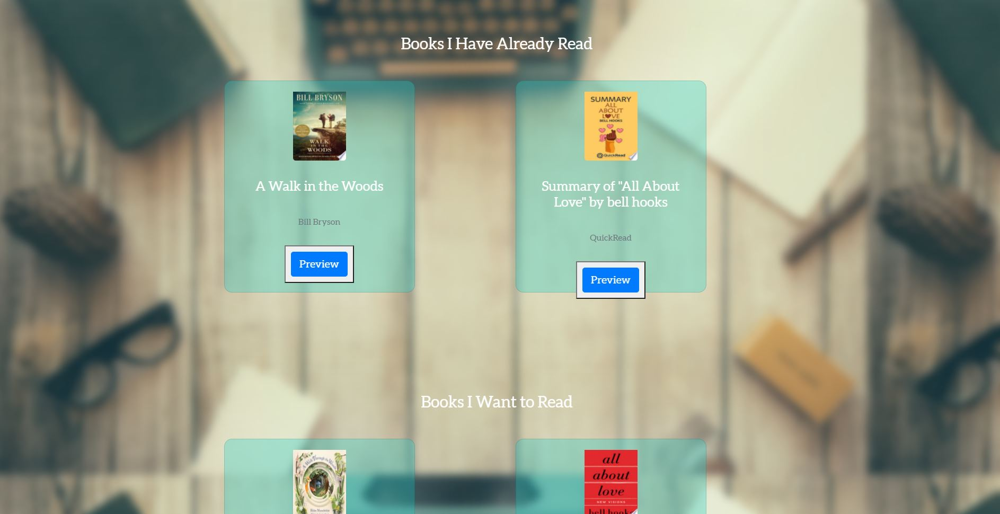

# Unit 15: Project 2 EyeRead

## Table of Contents

* [Deployed Site](#deployed-site)
* [User Story](#user-story)
* [Description](#description)
* [Process](#process)
* [Screenshots](#screenshots)
* [Sources](#sources)
* [Technologies](#Technologies)
* [Installation](#installation)
* [Credits](#Credits)
* [License](#License)
* [Contributing](#contributing)

## Deployed Site
---
Deployed Website: https://eyeread-app.herokuapp.com/

## User Story
---
User Story:  Are you an avid reader?  Do you have an interest in reading but don’t know where to begin.  eyeRead is an online book club app where users can login, create reading lists, discuss books they’re currently reading and rate books they have read in the past.

## Description
---
The project has been designed to fetch and render relevant book information from the GOOGLE BOOKS API.  On the first page of the application the user will choose to either "LOGIN" or "SIGN UP" to gain access to the user profile.  Once the user has been verified by logging in the application will take the user to their profile.  Once on the profile page the user has the option to search for books within the SEARCH FIELD.  The GOOGLE BOOKS API will fetch the information for the specified book and render it's TITLE, AUTHOR, BOOK DESCRIPTION and BOOK IMAGE on the profile page.  The user has the option to add the book to either their BOOKS I HAVE READ or BOOKS I WANT TO READ list.  The user will have the ability to add and store comments about the books in their BOOKS I HAVE READ or BOOKS I WANT TO READ list.

## Process
---
- We used google book Api to get data information for this application. We used axios package to make http request from node.js and get back the data from the Api. 
- We used sequelize and node to setup the server for our app, Express.js as the middleware and Handlebars as the templates rendering engine for this app.

## Screenshots
---
Home Page

Profile Page

## Sources
---
### Api
* [Google Book API](http://books.google.com/books/content?id=gK98gXR8onwC&printsec=frontcover&img=1&zoom=5&edge=curl&source=gbs_api)

## Technologies
---
- GOOGLE BOOKS API
- BOOTSTRAP
- MYSQL
- CSS
- JAVA SCRIPT
- Axios.js
- HANDLEBARS

## Installation
---
No need any installation for this project.

See deployed site here: https://eyeread-app.herokuapp.com/login

See repository here: https://github.com/Lauracejas/Project-2-Eye-Read

## Credits
---
- We want to thank Anthony and Max for all of their help!
- Class activities
- [google.com](https://www.google.com/)
- [npmjs](https://www.npmjs.com/)
- [Google Book API](http://books.google.com/books/content?id=gK98gXR8onwC&printsec=frontcover&img=1&zoom=5&edge=curl&source=gbs_api)

## License
---
- Copyright (c) 2021 Ryan Murdock, Phil Wang

Permission is hereby granted, free of charge, to any person obtaining a copy
of this software and associated documentation files (the "Software"), to deal
in the Software without restriction, including without limitation the rights
to use, copy, modify, merge, publish, distribute, sublicense, and/or sell
copies of the Software, and to permit persons to whom the Software is
furnished to do so, subject to the following conditions:

The above copyright notice and this permission notice shall be included in all
copies or substantial portions of the Software.

THE SOFTWARE IS PROVIDED "AS IS", WITHOUT WARRANTY OF ANY KIND, EXPRESS OR
IMPLIED, INCLUDING BUT NOT LIMITED TO THE WARRANTIES OF MERCHANTABILITY,
FITNESS FOR A PARTICULAR PURPOSE AND NONINFRINGEMENT. IN NO EVENT SHALL THE
AUTHORS OR COPYRIGHT HOLDERS BE LIABLE FOR ANY CLAIM, DAMAGES OR OTHER
LIABILITY, WHETHER IN AN ACTION OF CONTRACT, TORT OR OTHERWISE, ARISING FROM,
OUT OF OR IN CONNECTION WITH THE SOFTWARE OR THE USE OR OTHER DEALINGS IN THE
SOFTWARE.

## Contributing
---

Laura Cejas: [@Lauracejas](https://github.com/Lauracejas)

John Kim: [@JohnKim](https://github.com/mother426)

Carlos Abril: [@cabril87](https://github.com/cabril87git)

Taylor Weeks: [@Taylor](https://github.com/tweeks07)

© 2021 Trilogy Education Services, LLC, a 2U, Inc. brand. Confidential and Proprietary. All Rights Reserved.